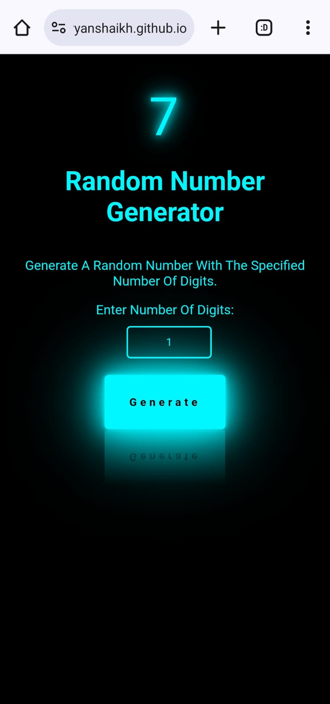

# Random Number Generator

This project implements a simple Random Number Generator web application. Users can specify the number of digits they want in a randomly generated number, and the application dynamically adjusts the font size of the displayed number based on the screen size.

## Screenshots

### Desktop Preview

### Mobile Preview

## Files

- **index.html:** The main HTML file containing the structure of the web page, including input fields, buttons, and the area for displaying the random number.

- **styles.css:** The CSS file providing styling for the web page, including the appearance of the random number, form inputs, and responsive design for different screen sizes.

- **script.js:** The JavaScript file handling the generation of random numbers, updating the font size based on user input and screen size, and managing event listeners.

## Usage

1. Click [HERE](https://ryanshaikh.github.io/RandomNumberGenerator/) to open the Random Number Generator web application.

2. Enter the desired number of digits in the input field labeled "Enter Number Of Digits."

3. Click the "Generate" button to generate a random number with the specified number of digits. The font size of the displayed number dynamically adjusts based on the input and screen size.

## Responsive Design

- The application is designed to be responsive, adapting to different screen sizes. The font size of the random number changes dynamically for small, medium, and large screens.

## How It Works

- The JavaScript code handles the generation of random numbers within the specified digit range.

- The font size is adjusted based on the number of digits entered and the current screen size.

- The application provides a visually appealing and interactive way to generate random numbers.

## CodePen

For additional examples and experimentation, you can also find the project on [CodePen](https://codepen.io/ryanshaikh/pen/QWoWZjK).

[Random Number Generator on CodePen](https://codepen.io/ryanshaikh/pen/QWoWZjK)

## Contributor

- **RYAN SHAIKH**
  - [GitHub](https://github.com/ryanshaikh)
  - [CodePen](https://codepen.io/ryanshaikh/pen/QWoWZjK)
  - [Instagram](https://www.instagram.com/ryanshaikhofficial/)
  - [Twitter](https://twitter.com/REALRYANSHAIKH/)

## License

### License: RS Open Source License

This project is licensed under the RS Open Source License - see the [LICENSE](LICENSE) file for details.
